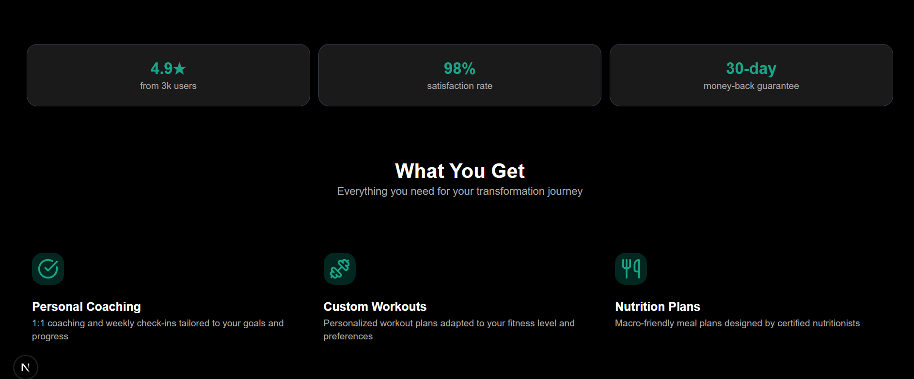
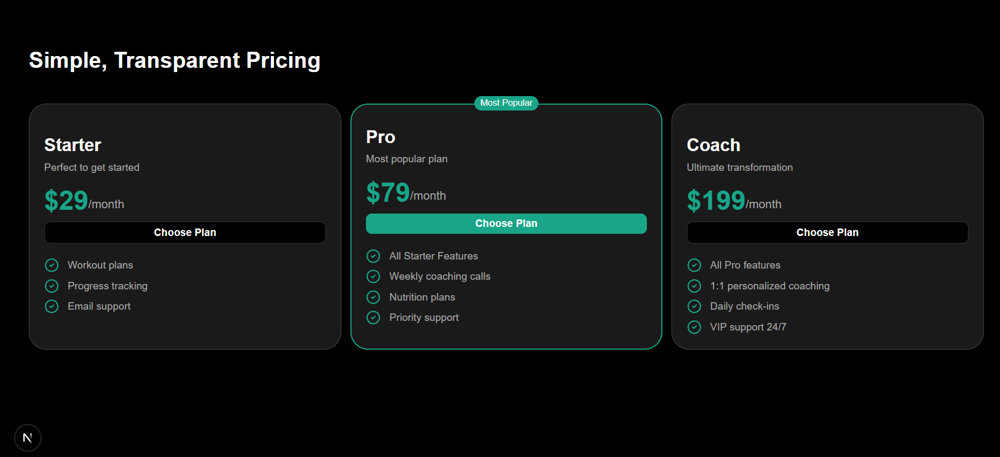
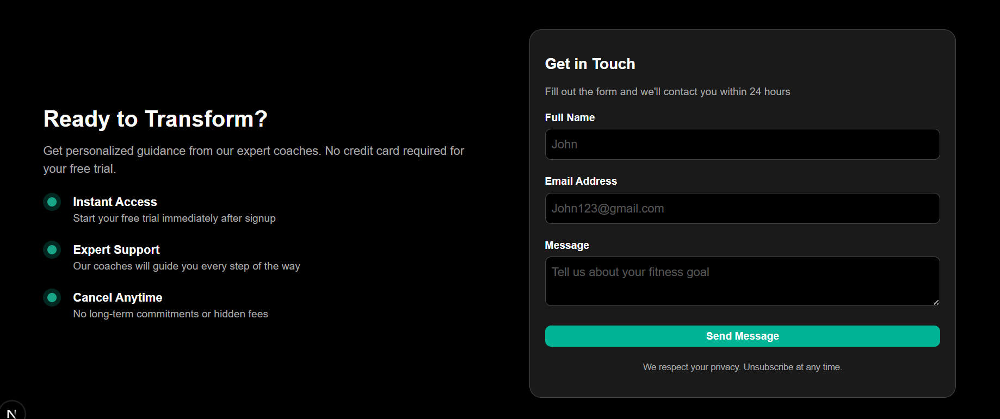

# Fitness Coaching — FitFlow (Landing Page)

**Stack:** Next.js (App Router), TypeScript, Tailwind CSS  
**Deployed:** https://github.com/itsgauravkumar07/FitFlow-landing
**Repo:** https://fit-flow-landing-ten.vercel.app/

## About
Landing page for FitFlow — a fitness coaching service. Includes:
- Hero (headline, subtext, CTA)
- Features (3 items)
- Testimonials
- Pricing 
- Contact
- Footer

## ScreenShots






## How I used Vercel v0
I used Vercel v0 to prototype the UI sections (Hero, Features, Testimonials, Pricing and Footer). The layout and initial HTML/CSS were generated with v0 prompts, then I rewrote and refactored each section into clean Next.js/TypeScript components and applied Tailwind for styling and responsiveness.

## Run locally
```bash
npm install
npm run dev
# open http://localhost:3000
